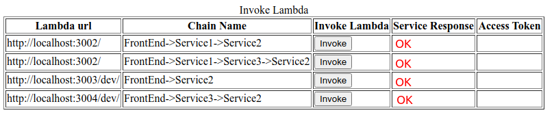
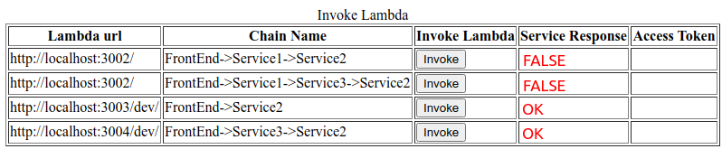
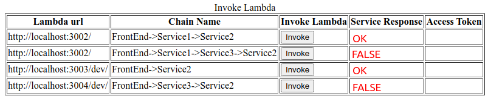

# Chain of service calls


## 1. Start Keycloak

### Docker
Using the image from https://hub.docker.com/r/jboss/keycloak/
```
docker run -p 8090:8080 -e JAVA_OPTS="-Dkeycloak.profile.feature.scripts=enabled -Dkeycloak.profile.feature.upload_scripts=enabled -server -Xms64m -Xmx512m -XX:MetaspaceSize=96M -XX:MaxMetaspaceSize=256m -Djava.net.preferIPv4Stack=true -Djboss.modules.system.pkgs=org.jboss.byteman -Djava.awt.headless=true" -e KEYCLOAK_USER=admin -e KEYCLOAK_PASSWORD=admin  -v `pwd`/example/chain-service-calls:/chain-service-calls  -e KEYCLOAK_IMPORT=/chain-service-calls/example-realm-export.json  jboss/keycloak
```
###  Standard
```
sh bin/standalone.sh  -c standalone.xml -b 0.0.0.0 -Djboss.bind.address.management=0.0.0.0 --debug 8190 -Djboss.http.port=8090
```
Open the Keycloak admin console, click on Add Realm, click on import 'Select file', select example-realm-export.json and click Create.

## 2. Run Services Locally
- Service1
```bash
cd service1
npm i
npm run start
```
- Service2
```bash
cd service2
npm i
npm run offline
```
- Service3
```bash
cd service3
npm i
npm run offline
```

## 3. Run UI locally

```bash
cd frontend
npm i
npm run start
```

## 4. Open UI
[http://localhost:3001](http://localhost:3001)

users:

| User      | Password   | Service 1 Role 1 | Service 1 Role 2 | Service 2 Role | Service 3 Role |
|:----------|:-----------|:-----------------|:-----------------|:---------------|:---------------|
| user      | user       | X                | X                | X              | X              |
| user1     | user1      | -                | -                | X              | X              |
| user2     | user2      | X                | -                | -              | X              |

## 6. Results

| User      | Result                                                                                                 | Description                                           |
|:----------|:-------------------------------------------------------------------------------------------------------|:------------------------------------------------------|
| User      |                                                                           | All Access                                            |
| User1      |                                                                         | FrontEnd->Service2 and FrontEnd->Service3->Service2   |                                           |
| User1      |                                                                         | FrontEnd->Service1->Service2 and FrontEnd->Service2   |
