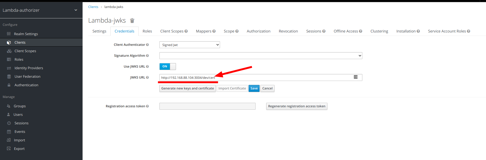
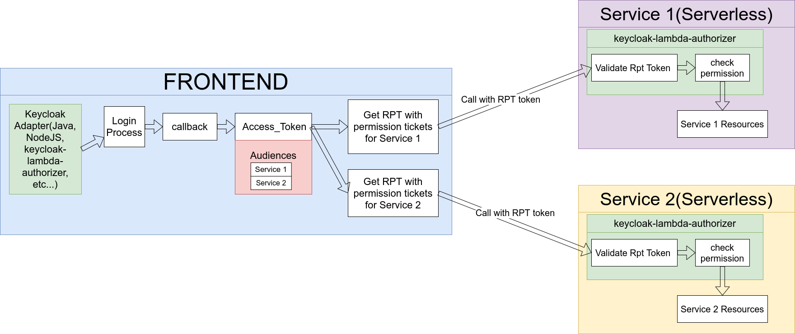
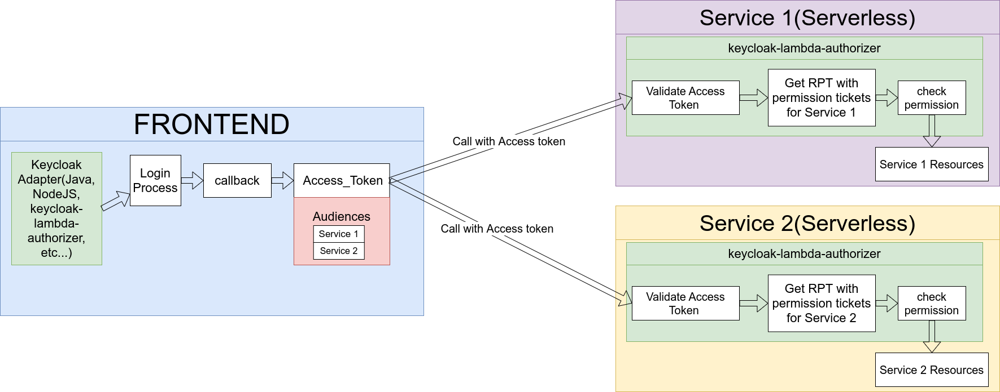
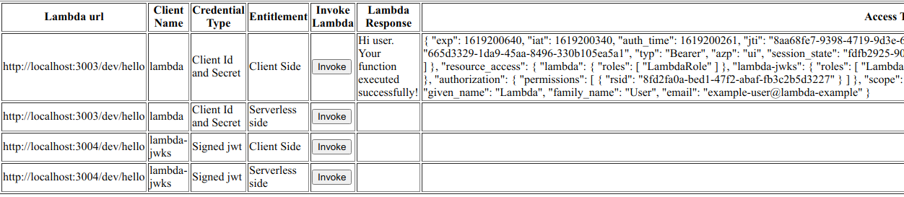
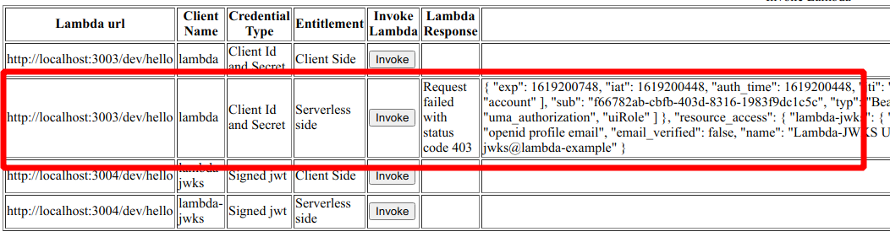
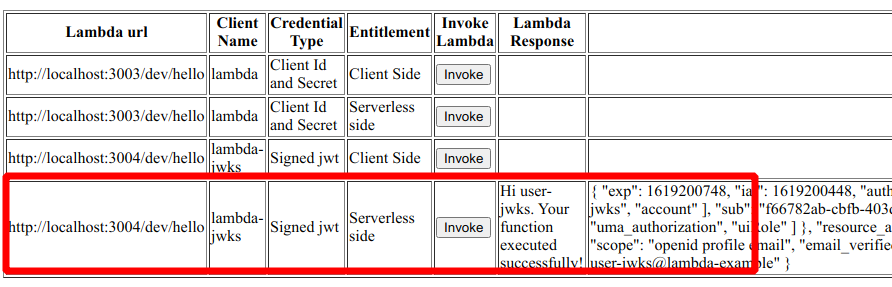
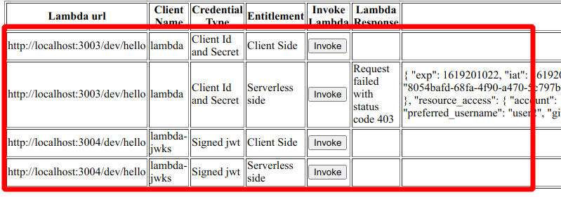
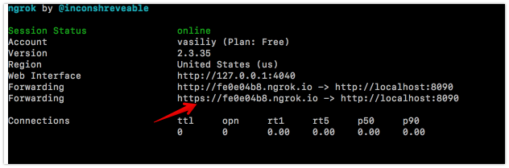
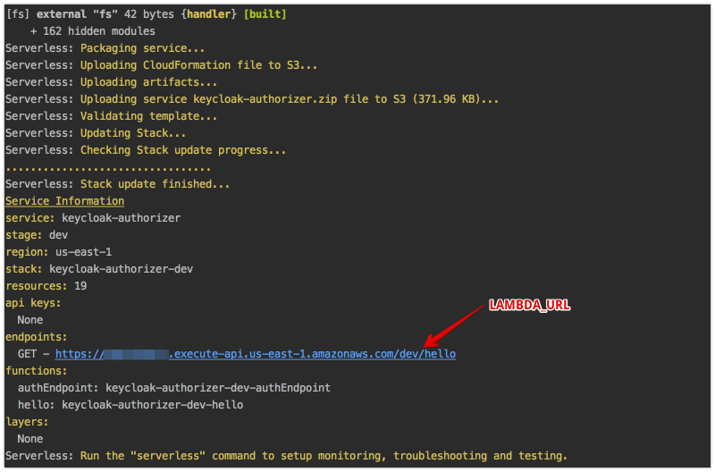
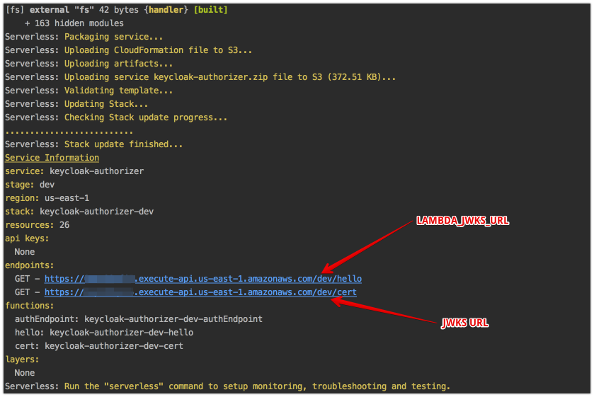

# Api gateway with lambda authorizer

## 1. Start Keycloak

### Docker
Using the image from https://hub.docker.com/r/jboss/keycloak/
```
docker run -p 8090:8080 -e JAVA_OPTS="-Dkeycloak.profile.feature.scripts=enabled -Dkeycloak.profile.feature.upload_scripts=enabled -server -Xms64m -Xmx512m -XX:MetaspaceSize=96M -XX:MaxMetaspaceSize=256m -Djava.net.preferIPv4Stack=true -Djboss.modules.system.pkgs=org.jboss.byteman -Djava.awt.headless=true" -e KEYCLOAK_USER=admin -e KEYCLOAK_PASSWORD=admin  -v `pwd`/example/keycloak-authorizer:/keycloak-authorizer  -e KEYCLOAK_IMPORT=/keycloak-authorizer/example-realm-export.json  jboss/keycloak
```
###  Standard
```
sh bin/standalone.sh  -c standalone.xml -b 0.0.0.0 -Djboss.bind.address.management=0.0.0.0 --debug 8190 -Djboss.http.port=8090
```
Open the Keycloak admin console, click on Add Realm, click on import 'Select file', select example-realm-export.json and click Create.

## 2. Run Serverless offline (Client Id and Secret credential Type)

```

### 6.1 Deploy Lambda`s

```bash
cd serverless
npm i
cd ../../..
sudo npm link
cd example/keycloak-authorizer/serverless
npm link keycloak-lambda-authorizer
npm run offline
```
Client Credentials:


## 2. Run Serverless offline (Client jwt credential Type)
```bash
cd serverless-jwks
npm i
cd ../../.. && npm link && cd example/keycloak-authorizer/serverless && npm link keycloak-lambda-authorizer
npm run offline
```

Client Credentials:

- Note. If you are using a docker image, then you need to override localhost with  with your host ip:



## 3. Run UI locally

```bash
cd ui
npm i
npm run start
```

## 4. Open UI
[http://localhost:3001](http://localhost:3001)


users:

| User      | password  | UI Permission | Lambda Permission | Lambda-JWKS Permission |
|:----------|:----------|:--------------|:------------------|:-----------------------|
| user      | user      | X             | X                 | X                      |
| user-jwks | user-jwks | X             | -                 | X                      |
| user2     | user2     | X             | -                 | -                      |
| user3     | user3     | -             | -                 | -                      |

Permissions:

| Permission        | Permission Name  | Policy Name  | Resource       | Action                      |
|:------------------|:-----------------|:-------------|:---------------|:----------------------------|
| UI Permission     | uiRolePermission | uiRolePolicy | uiResource     | Access To UI                |
| Lambda Permission | lambdaPermission | lambdaPolicy | LambdaResource | Permission To Invoke Lambda |

## 5. Entitlement Types
### 5.1 Client Side

### 5.2 Serverless side


## 6. Results

| User      | Result                                                                                                 | Description                                           |
|:----------|:-------------------------------------------------------------------------------------------------------|:------------------------------------------------------|
| User      |  | All Access                                            |
| user-jwks |   | lambda-jwks only                                      |
| User2     |  | Has access to UI but does not have access to Lambda`s |
| User3     |              | Does not have access to UI and Lambda`s               |

## 7. Deploy to cloud
### 7.1 Run Keycloak with ngrok
```console
ngrok http 8080
```

### 7.2 Modify keycloak.json with a new host

example/keycloak-authorizer/ui/keycloak.json
```json
{
  "realm": "lambda-authorizer",
  "auth-server-url": "https://fe0e04b8.ngrok.io/auth",
  "ssl-required": "external",
  "resource": "ui",
  "verify-token-audience": true,
  "credentials": {
    "secret": "ddfb7637-6f8b-4ca8-98f5-90af1801198a"
  },
  "confidential-port": 0,
  "policy-enforcer": {}
}
```

example/resources/keycloak.json
```json
{
  "realm": "lambda-authorizer",
  "auth-server-url": "https://fe0e04b8.ngrok.io/auth",
  "ssl-required": "external",
  "resource": "lambda",
  "verify-token-audience": true,
  "credentials": {
    "secret": "772decbe-0151-4b08-8171-bec6d097293b"
  },
  "confidential-port": 0,
  "policy-enforcer": {}
}
```
example/resources/keycloak.json
```json
{
  "realm": "lambda-authorizer",
  "auth-server-url": "https://fe0e04b8.ngrok.io/auth",
  "ssl-required": "external",
  "resource": "lambda-jwks",
  "verify-token-audience": true,
  "credentials": {
  },
  "use-resource-role-mappings": true,
  "confidential-port": 0,
  "policy-enforcer": {}
}
```

### 7.2 Deploy Lambda`s
- deploy serverless
```bash
cd serverless
npm i
cd ../../.. && npm link && cd example/keycloak-authorizer/serverless-jwks && npm link keycloak-lambda-authorizer
serverless deploy
```


- deploy serverless-jwks
```bash
cd serverless-jwks
npm i
cd ../../.. && npm link && cd example/keycloak-authorizer/serverless-jwks && npm link keycloak-lambda-authorizer
serverless deploy
```

### 6.3 set JWKS Url on Keycloak

### 6.4 Run UI locally pointing to remote lambdas
```bash
LAMBDA_URL=https://xxxxxxxxxx.execute-api.us-east-1.amazonaws.com/dev/hello LAMBDA_JWKS_URL=https://yyyyyyyyyy.execute-api.us-east-1.amazonaws.com/dev/hello node index.js
```
