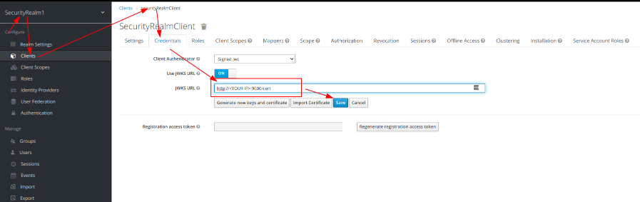
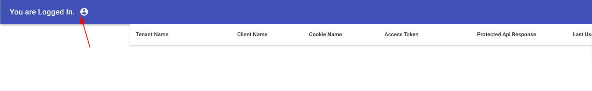
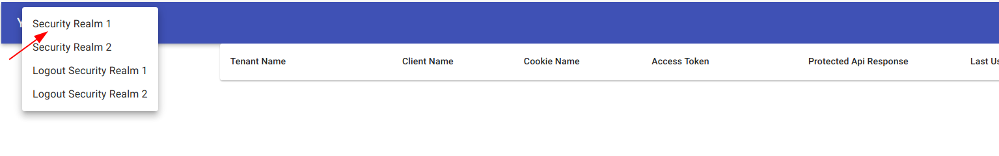

# Cloudfront(Lambda:edge) with portal authorization (Cross-realm authentication)

Solution how to loggedin to one realm and then switching to another realms without asking the password.

## 1. Start Keycloak

### Docker
1. Using the image from https://hub.docker.com/r/jboss/keycloak/
```
docker run -p 8080:8080 -e JAVA_OPTS="-Dkeycloak.profile.feature.scripts=enabled -Dkeycloak.profile.feature.upload_scripts=enabled -server -Xms64m -Xmx512m -XX:MetaspaceSize=96M -XX:MaxMetaspaceSize=256m -Djava.net.preferIPv4Stack=true -Djboss.modules.system.pkgs=org.jboss.byteman -Djava.awt.headless=true" -e KEYCLOAK_USER=admin -e KEYCLOAK_PASSWORD=admin  jboss/keycloak
```
2. **Open the Keycloak admin console, click on Add Realm, click on import 'Select file', select [portal-realm.json](portal-realm.json) and click Create.**
3. **Open the Keycloak admin console, click on Add Realm, click on import 'Select file', select [securityRealm1.json](securityRealm1.json) and click Create.**
4. **Open the Keycloak admin console, click on Add Realm, click on import 'Select file', select [securityRealm2.json](securityRealm2.json) and click Create.**]
5. change JWKS URL for SecurityRealm1:
replace with http://<YOUR DEVICE IP>:8080/cert instead of http://localhost:8080/cert  
6. change JWKS URL for SecurityRealm2:
replace with http://<YOUR DEVICE IP>:8080/cert instead of http://localhost:8080/cert
###  Standard
1. Download Keycloak from https://www.keycloak.org/downloads
```
sh bin/standalone.sh  -c standalone.xml -b 0.0.0.0 -Djboss.bind.address.management=0.0.0.0 --debug 8190 -Djboss.http.port=8090
```
```
2. **Open the Keycloak admin console, click on Add Realm, click on import 'Select file', select [portal-realm.json](portal-realm.json) and click Create.**
3. **Open the Keycloak admin console, click on Add Realm, click on import 'Select file', select [securityRealm1.json](securityRealm1.json) and click Create.**
4. **Open the Keycloak admin console, click on Add Realm, click on import 'Select file', select [securityRealm2.json](securityRealm2.json) and click Create.**]


### Run emulation cloudfront and lambda:edge locally

```bash
cd lambda-edge-example
npm i
cd ..
npm i
npm run start
```

### Deploy to cloud using aws CDK
```bash
cd keycloak-cloudfront-cdk
./deploy.sh -n "<unique S3 Bucket>" -r "arn:aws:iam::<AWS-ACCOUNT>:role/<ROLE>"
```

### Portal Users:

| Portal User | Portal password | Security Realm 1 | Security Realm 1 |
|:------------|:----------------|:-----------------|:-----------------|
| user        | user            | X                | X                |
| user1       | user1           | X                | -                |
| user2       | user2           | -                | X                |

### Switch Tenant:

Tenant Selector : 
Select to Security Tenant 1: 
Select to Security Tenant 2: 