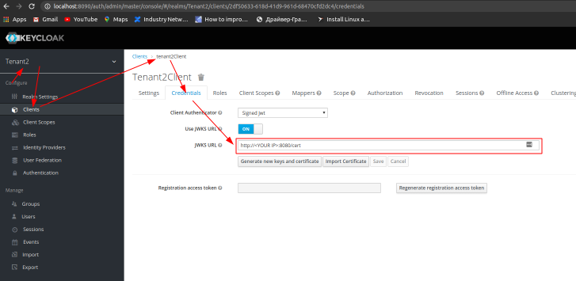

# Cloudfront(Lambda:edge) with lambda authorizer

## 1. Start Keycloak

### Docker
Using the image from https://hub.docker.com/r/jboss/keycloak/
```
docker run -p 8090:8080 -e JAVA_OPTS="-Dkeycloak.profile.feature.scripts=enabled -Dkeycloak.profile.feature.upload_scripts=enabled -server -Xms64m -Xmx512m -XX:MetaspaceSize=96M -XX:MaxMetaspaceSize=256m -Djava.net.preferIPv4Stack=true -Djboss.modules.system.pkgs=org.jboss.byteman -Djava.awt.headless=true" -e KEYCLOAK_USER=admin -e KEYCLOAK_PASSWORD=admin  jboss/keycloak
```
change JWKS URL for Tenant2:

replace with http://<YOUR DEVICE IP>:8080/cert instead of http://localhost:8080/cert
###  Standard
```
sh bin/standalone.sh  -c standalone.xml -b 0.0.0.0 -Djboss.bind.address.management=0.0.0.0 --debug 8190 -Djboss.http.port=8090
```
**Open the Keycloak admin console, click on Add Realm, click on import 'Select file', select realm-tenant1.json and realm-tenant2.json and click Create.
**
## 2. Run emulation cloudfront and lambda:edge locally

```bash
cd lambda-edge-example
npm i
cd ..
npm i
npm run start
```

## 3. Deploy to cloud using aws CDK
```bash
cd keycloak-cloudfront-cdk
./deploy.sh -n "<unique S3 Bucket>" -r "arn:aws:iam::<AWS-ACCOUNT>:role/<ROLE>"
```

## 4. Users:

| User         | password  | Realm Name    |  Client Type        |
|:-------------|:----------|:--------------|:--------------------|
| tenant1      | tenant1   | tenant1       | clientId and Secret |
| tenant2      | tenant2   | Tenant2       | client jwt          |

## 5. Switch Tenant:


