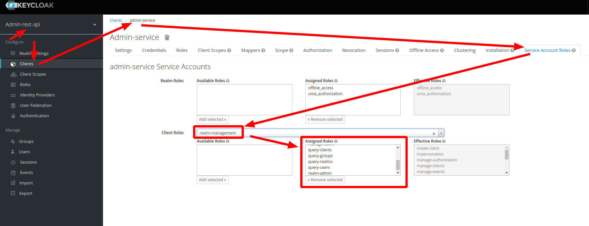
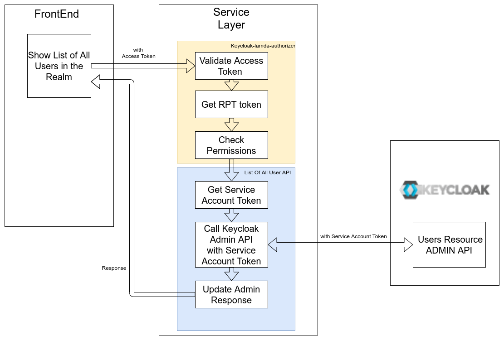

# Example of Calling the Admin API Using User Permissions (Role or Resource)

This example allow to get list of users and List of security clients (with secrets) using regular user permissions.

## How it works
User calls the service API using their own token, but the service API calls Keycloak using the service account token (service-to-service communication)
- **user has no administrator roles!!!**
- service Account has Admin Roles 
- FrontEnd does not have access to call Admin Api.


## 1. Start Keycloak

### Docker
Using the image from https://hub.docker.com/r/jboss/keycloak/
```
docker run -p 8090:8080 -e JAVA_OPTS="-Dkeycloak.profile.feature.scripts=enabled -Dkeycloak.profile.feature.upload_scripts=enabled -server -Xms64m -Xmx512m -XX:MetaspaceSize=96M -XX:MaxMetaspaceSize=256m -Djava.net.preferIPv4Stack=true -Djboss.modules.system.pkgs=org.jboss.byteman -Djava.awt.headless=true" -e KEYCLOAK_USER=admin -e KEYCLOAK_PASSWORD=admin  -v `pwd`:/userToAdminAPI  -e KEYCLOAK_IMPORT=/userToAdminAPI/example-realm-export.json  jboss/keycloak
```
###  Standard
```
sh bin/standalone.sh  -c standalone.xml -b 0.0.0.0 -Djboss.bind.address.management=0.0.0.0 --debug 8190 -Djboss.http.port=8090
```
Open the Keycloak admin console, click on Add Realm, click on import 'Select file', select example-realm-export.json and click Create.

## 2. Run Services Locally
- Express Service
```bash
cd express-service
npm i
npm run start
```

## 3. Run UI locally

```bash
cd frontend
npm i
npm run start
```

## 4. Open UI
[http://localhost:3001](http://localhost:3001)

users:

| User      | Password   | UserList Role    | Client List Role | Client Secret Role |
|:----------|:-----------|:-----------------|:-----------------|:-------------------|
| user      | user       | X                | X                | X                  |
| user1     | user1      | -                | X                | X                  |
| user2     | user2      | -                | X                | -                  |

## 6. Results

| User      | Result                                                                                                 | Description                                           |
|:----------|:-------------------------------------------------------------------------------------------------------|:------------------------------------------------------|
| User      |  User List, Client List with secrets                                                                   | All Access                                            |
| User1     |  Client List with secrets                                                                              | User has access to  Client List  and secrets          |
| User2     |  Client List without secrets                                                                           | User has access only to Client List                   |
